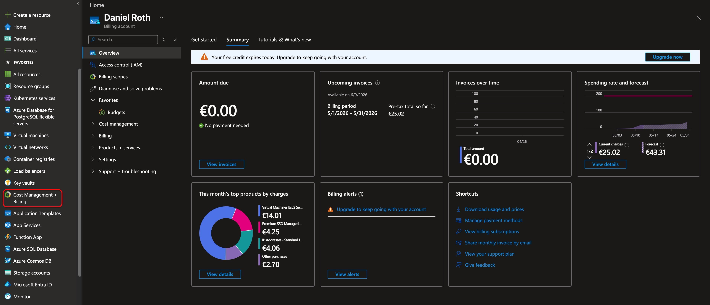
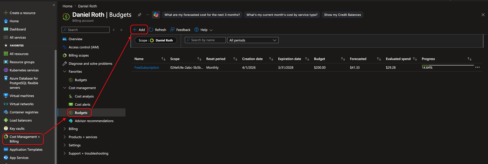
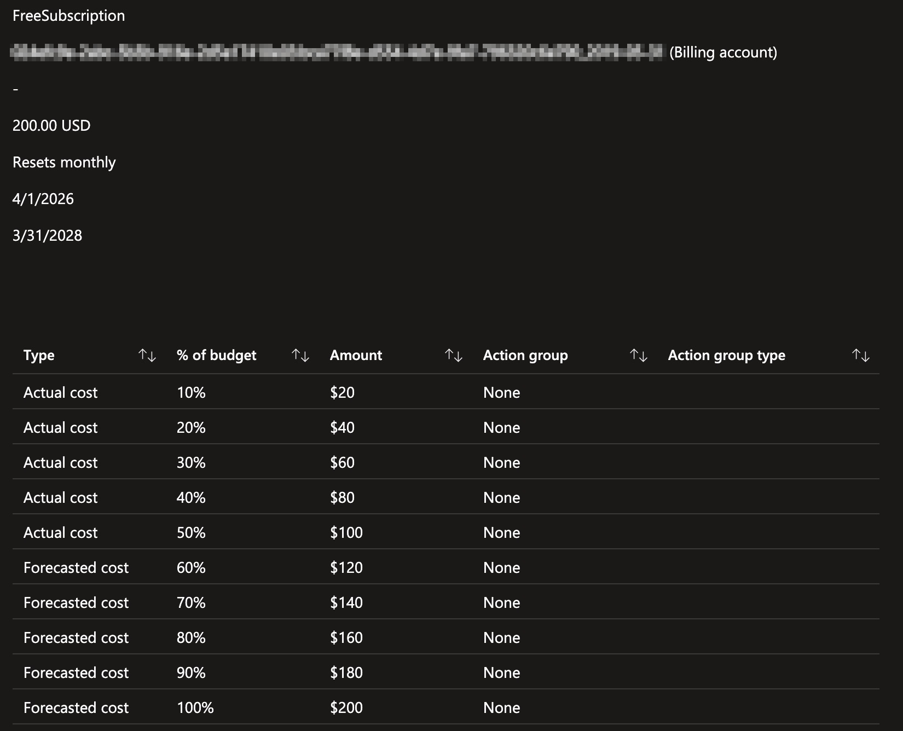
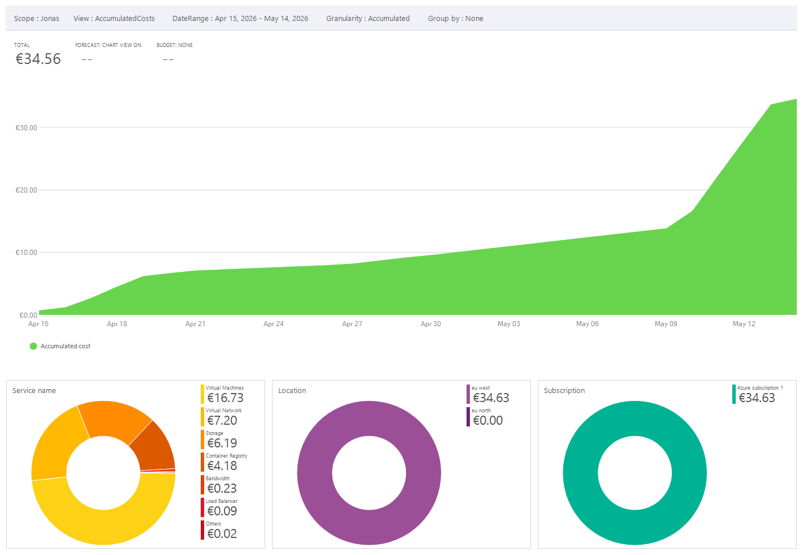
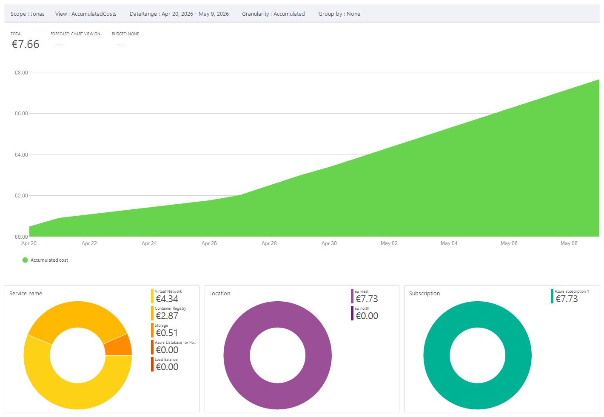
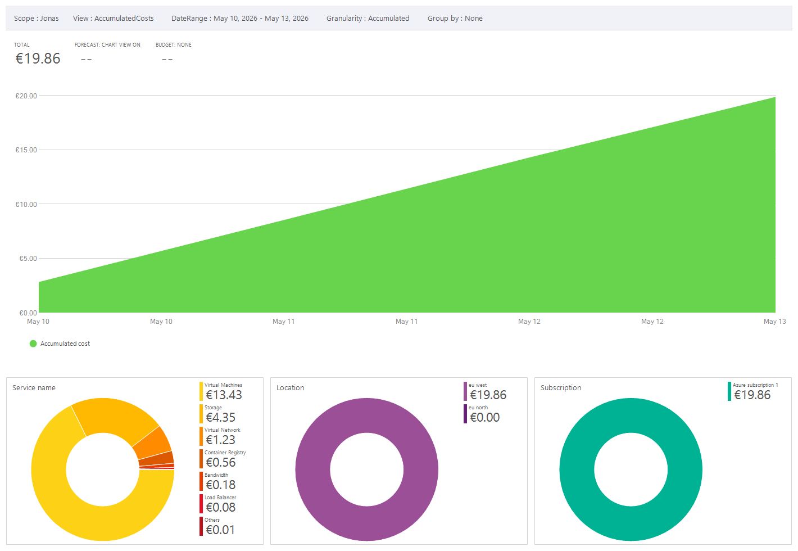

== Why the Azure cost view matters

Managed infrastructure is convenient, but it is not free simply because traffic is low. This page looks at the Azure Portal cost views for the ERP demo and explains which costs remain when the cluster is stopped versus when it is running.

IMPORTANT: The screenshots on this page reflect a free subscription with almost no application traffic. These are mostly upkeep costs, not usage-driven costs from real users.

IMPORTANT: PostgreSQL was effectively free in this setup because of the subscription conditions. Do not assume that for a paid or production environment; a production PostgreSQL Flexible Server should be treated as a real line item.

== Enter cost management from Azure Portal

The Azure Portal subscription view gives the first indication that money is being spent. From there, `Cost Management + Billing` is the entry point for the more detailed analysis views.

.Azure cost management entry point for the subscription

== Configure budgets before leaving the cluster running

Budgets are one of the most useful safety measures for a demo subscription. They do not stop resources automatically, but they do send alerts before a quiet demo cluster turns into a surprising invoice.

.Budget configuration in Azure Cost Management

.Budget overview for the free subscription used by this environment

== Thirty-day cost trend

The accumulated-cost view makes the start-and-stop effect visible immediately. While the cluster was stopped from April 19 to May 9, the curve increased only slowly. Once the cluster was running again from May 10 to May 13, the slope became much steeper even though there was still basically no traffic on the platform.

.Accumulated cost over the last 30 days

[cols="1,1,1,1,2",options="header"]
|===
| Period | Cluster state | Total cost | Approx. daily rate in billed window | Dominant cost drivers

| April 19 to May 9
| Stopped
| 7.66 EUR
| 0.38 EUR/day
| Virtual network at 4.34 EUR and container registry at 2.87 EUR; no virtual-machine cost.

| May 10 to May 13
| Running
| 17.06 EUR
| 5.69 EUR/day
| Virtual machines at 13.43 EUR and storage at 4.35 EUR.
|===

This comparison is the important operational lesson for the Azure path: stopping AKS removes the dominant compute cost, but it does not make the environment free. Persistent resources such as networking and container registry remain billable.

== Cost profile while the cluster is stopped

In the stopped window, there is no meaningful virtual-machine cost. What remains is the baseline infrastructure that still exists even though workloads are not running.

.Cost analysis while the cluster was stopped

The stopped-period chart shows why the stop script is worth using for a demo. The residual cost is small compared with the running cluster, and it comes mostly from assets that still exist: the virtual network and the container registry.

== Cost profile while the cluster is running

The running window tells a different story. Even without traffic, the cluster resumes paying for the underlying compute and the related storage footprint.

.Cost analysis while the cluster was running

This is why an always-on AKS environment should be treated as a deliberate cost choice. For a real production system the spend would normally increase further because traffic, managed database cost, backups, and other service consumption would add to the baseline shown here.