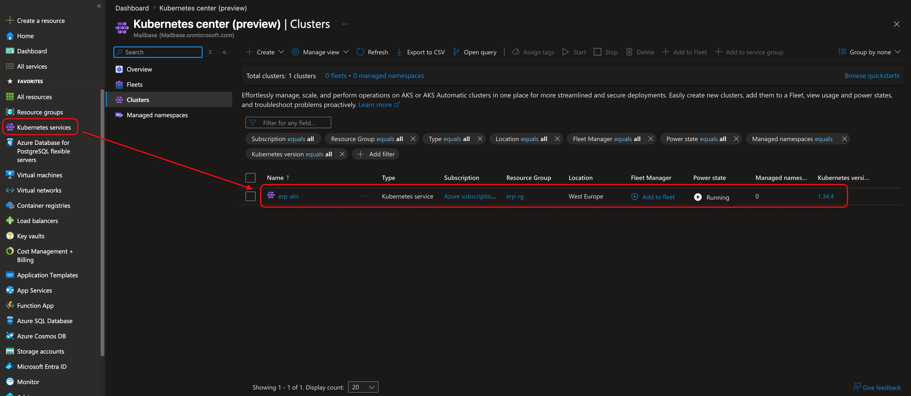
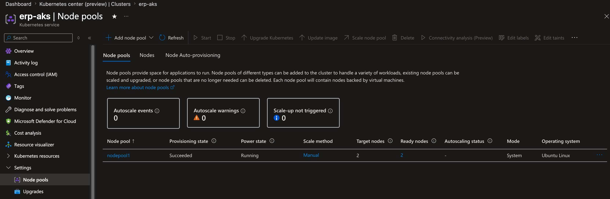
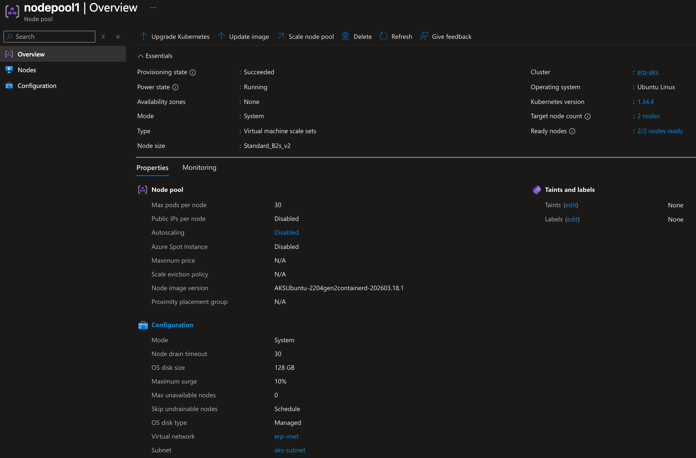
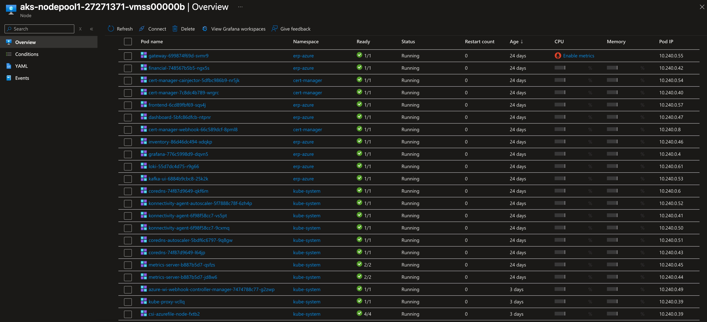
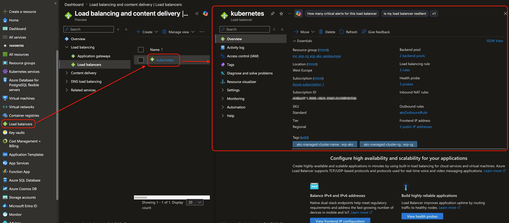

== Start and stop the cluster without redeploying

The environment can be paused when it is idle and resumed later without rebuilding images or redeploying manifests. That makes Azure more affordable for a demo environment that is not needed 24 hours a day.

IMPORTANT: Run `az login` before using the start or stop scripts. They call Azure CLI directly, so a reboot or expired session requires another login.

IMPORTANT: Stopping the environment removes compute cost, but not all cost. Storage, the public IP and load balancer, ACR, and other persistent resources can still incur charges.

=== What the stop stage does

The stop script shuts down AKS and PostgreSQL in that order.

[source,bash]
----
az aks stop --resource-group "$AZ_RESOURCE_GROUP" --name "$AZ_AKS_NAME"

az postgres flexible-server stop \
	--resource-group "$AZ_RESOURCE_GROUP" \
	--name "$AZ_PG_SERVER_NAME"
----

This is the aggressive cost-saving step. The cluster state is preserved, but the compute backing it is suspended. The script also documents the expected residual cost while stopped.

=== What the start stage does

The start script resumes PostgreSQL first, then starts AKS.

[source,bash]
----
PG_STATE=$(az postgres flexible-server show \
	--resource-group "$AZ_RESOURCE_GROUP" \
	--name "$AZ_PG_SERVER_NAME" \
	--query "state" -o tsv 2>/dev/null || echo "Unknown")

if [ "$PG_STATE" = "Stopped" ]; then
	az postgres flexible-server start \
		--resource-group "$AZ_RESOURCE_GROUP" \
		--name "$AZ_PG_SERVER_NAME"
fi

az aks start --resource-group "$AZ_RESOURCE_GROUP" --name "$AZ_AKS_NAME"
----

Two useful details are built into this flow.

* PostgreSQL is checked first so the script does not try to start it unnecessarily.
* The cluster comes back with its prior Kubernetes state intact, so no redeploy is needed just because you restarted it.

=== Check the environment after a start

Once the cluster has been resumed, pods need a few minutes to reschedule.

[source,bash]
----
KUBECONFIG=~/.kube/aks-erp.yaml kubectl get pods -n erp-azure
----

That command is the quickest post-start validation. You are looking for the ERP pods to return to a healthy `Running` state. The script itself also reminds you that the recovery time is typically around three to five minutes.

=== When a redeploy is actually necessary

Starting a previously stopped environment is not the same as deploying a new version.

You need a new deployment only when one of these changed:

* the image tag you want AKS to use,
* the manifests or runtime configuration,
* the Azure resources or secrets that the workloads depend on.

If none of those changed, `aks-start.sh` is enough.

=== Where Azure Portal becomes useful

The Portal is optional for the start and stop flow, but it becomes useful for management and analysis afterward.

==== Start from the AKS overview

The AKS overview is the fastest visual confirmation that you are looking at the correct cluster, region, node count, and resource group after a restart.

.AKS overview page for the ERP cluster

==== Inspect node pools and the underlying nodes

Once the cluster is running again, the node-pool views are the clearest way to confirm how much compute is available and which nodes Azure has brought back online. In a small demo cluster this matters because even a single missing node or an undersized node pool shows up immediately as scheduling pressure.

.Node pools configured for the ERP AKS cluster

.Selected node pool for the ERP AKS cluster

.Nodes running inside the selected node pool

The node view is especially useful in this project because it gives a concrete overview of what is actually deployed in the cluster after a restart. It turns the abstract idea of "the ERP services are running again" into a visible list of cluster nodes and workloads.

==== Check public exposure and load balancer assignments

Azure Portal is also useful when you need to confirm how the public entry point is wired. The load balancer view helps you verify that the Traefik service still owns the expected frontend IP and that the network objects created during provisioning are still present.

.Azure load balancers associated with the ERP deployment

The detailed cost discussion is separated onto the next page. That keeps this management page focused on operational inspection after a start or stop action, while the cost page analyzes which Azure resources continue charging when the cluster is idle.

The core operational principle still stays the same: deploy and control the environment with scripts, then use Azure Portal as a management and analysis surface when it helps.
